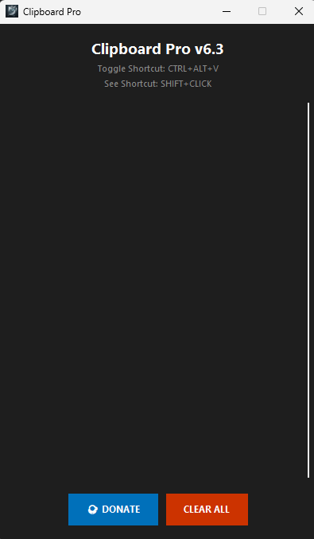

# 🌟 Clipboard Pro v6.3

**Clipboard Pro** is a powerful, lightweight utility for Windows that keeps track of everything you copy. Toggle it instantly with a hotkey and never lose a snippet again.

## ✨ Key Features
* ⌨️ **Global Hotkey:** Use `Ctrl + Alt + V` to show/hide the manager anywhere or `Shift + Click` to show a big screen with what you copied.
* 📥 **History Tracking:** Automatically saves your clipboard history (even after restart).
* 🛡️ **Tray Integration:** Runs quietly in the system tray.
* 🚀 **Auto-Startup:** Option to launch automatically when Windows starts.
* ☕ **Donation Support:** Integrated PayPal link for supporters.

## 🚀 Installation
1. Go to the [Releases](https://github.com/soccervortex/Clipboard-Pro/releases) page.
2. Download `ClipboardPro_v6.3_Installer.exe`.
3. Run the installer and follow the instructions.

## 🛠️ Built With
* Python 3.13
* Tkinter (GUI)
* PyInstaller (Bundling)
* Inno Setup (Installation)

---
*Created by Clipboard Pro*
